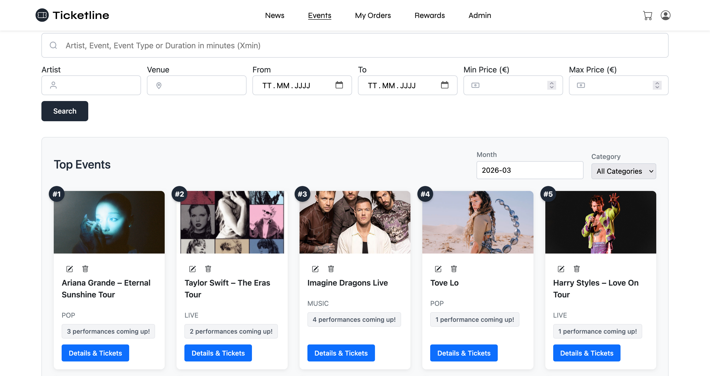
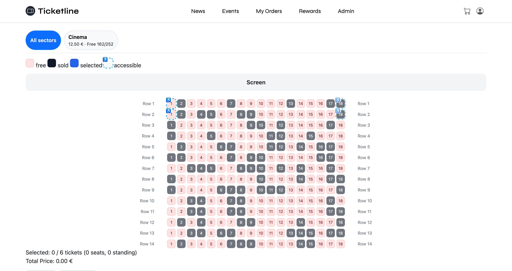
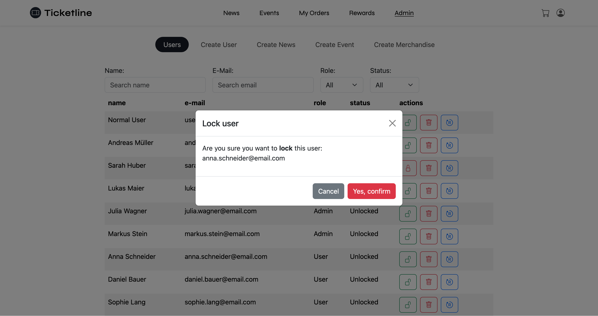

# TicketLine — Frontend

The frontend of a full-stack ticketing platform built as a university project. TicketLine combines an event ticket shop, event and news management for admins, and a complete purchase flow. The backend (Spring Boot) is maintained in a separate private repository.

### Tech Stack

Angular · TypeScript · HTML · CSS


### Screenshots

> **TicketLine 4.0 — Landing Page**
> 


> **Shop — Event Overview**
> 

> **Event Detail & Seat Selection**
> 

> **Admin — Management**
> 

### Getting Started

```bash
npm install
ng serve
```

The app runs on `http://localhost:4200`. A running backend instance is required for full functionality.


### Team

Developed by a team of 6 as part of a university course.

| Role | |
|---|---|
| UI Architect | [@w3br](https://github.com/w3br) |
| + 5 team members | |

### Assets

All images and media used in this project are for demonstration purposes only as part of a non-commercial university project. If you are the creator of any asset used and would like it removed or credited, please open an issue or reach out directly.
